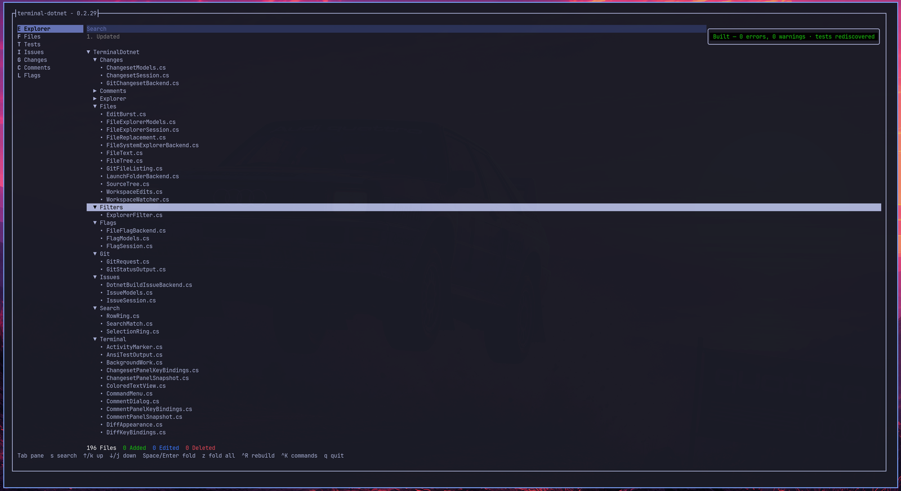
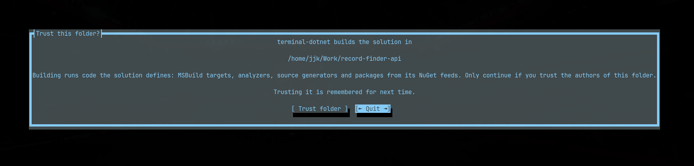
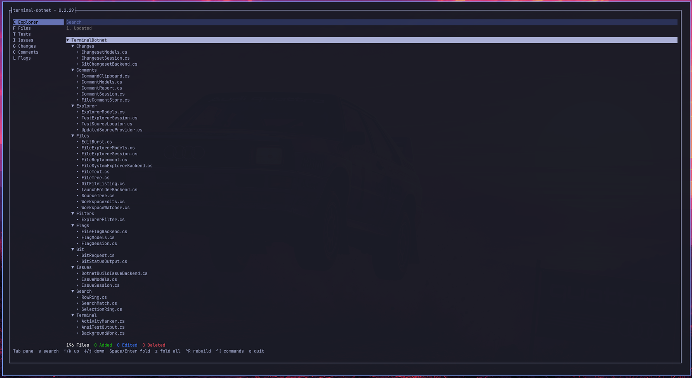
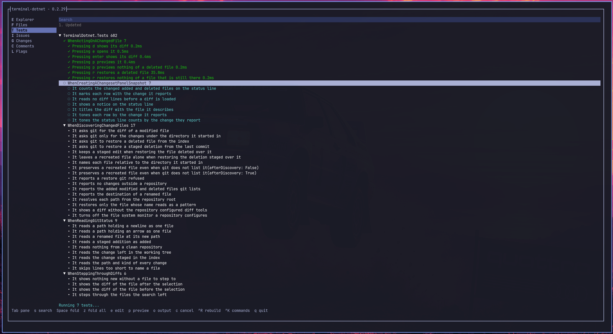
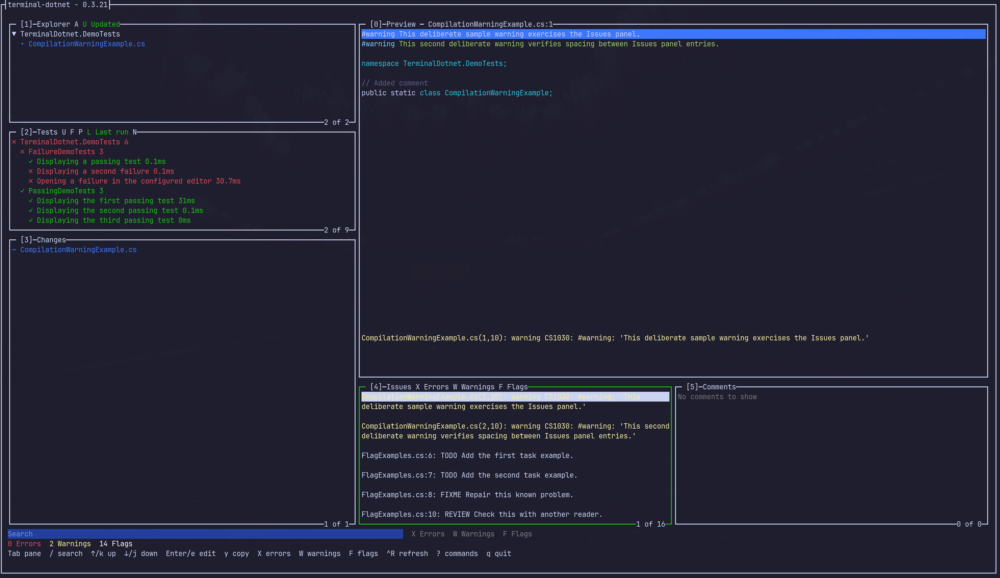
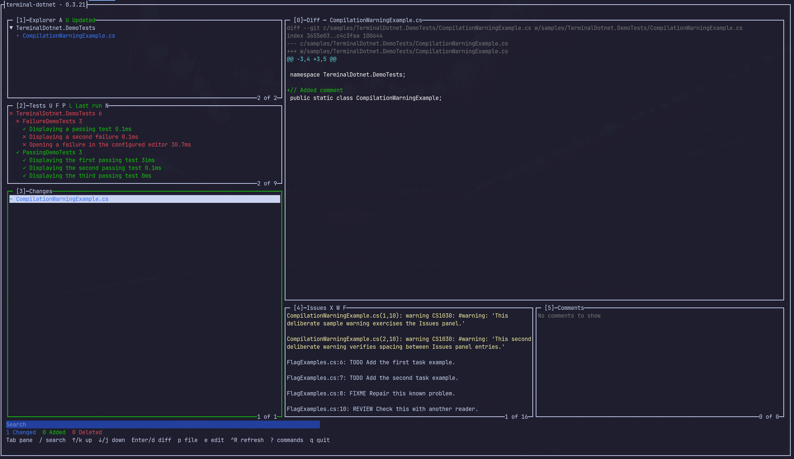
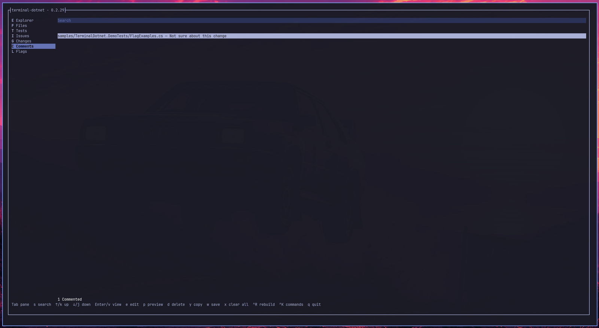
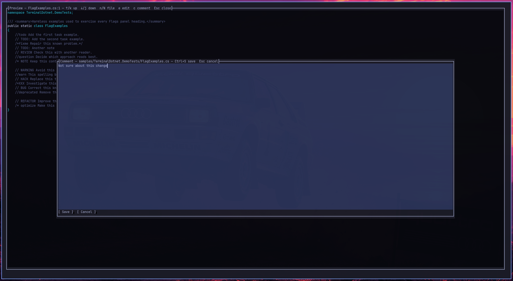
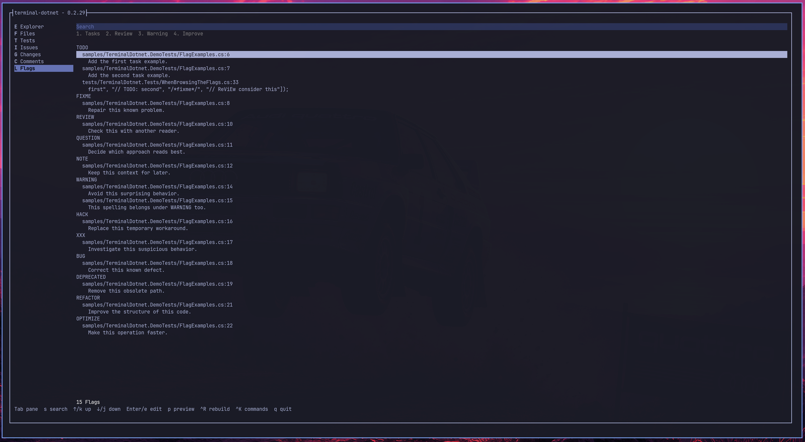
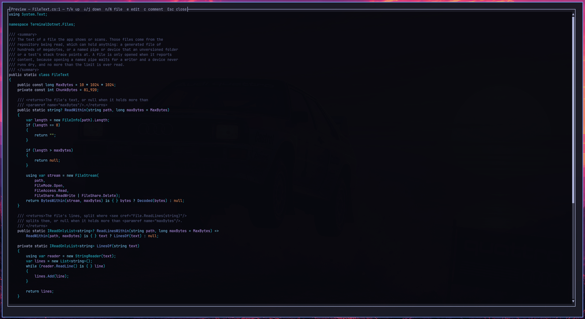

# terminal-dotnet

A keyboard-driven terminal workspace for .NET solutions. Browse the source, run
tests and jump to failures, read compiler errors, review git changes, collect
`TODO`s and leave notes, all from one screen beside your editor.

<!-- Screenshot: the Tests panel mid-run, with the tree on the left and output on the right -->


Runs on Linux, macOS and Windows. See [platform support](docs/platforms.md).

## Contents

- [Features](#features)
- [Requirements](#requirements)
- [Install](#install)
- [Getting started](#getting-started)
- [Panels](#panels)
- [Keys](#keys)
- [Configuration](#configuration)
- [Troubleshooting](#troubleshooting)
- [Security](#security)
- [Development](#development)

## Features

- **Seven panels in one two-column shell.** Explorer, Files, Tests, Issues,
  Changes, Comments and Flags share the same rail, search box, filters and
  keys.
- **Test explorer.** Discovers every test in the solution. Run a test, a class
  or a whole project; rerun the last set or only the failures; step between
  failures; and open the failing line in a preview or your editor.
- **Compiler issues.** Collects errors and warnings from `dotnet build`, filters
  them by severity, and opens or copies each one.
- **Git changes.** Lists added, modified and deleted files, shows and steps
  through their diffs, and restores deleted files.
- **Change-aware filters.** One key narrows the Explorer to the files git
  reports as changed, and the Tests panel to the suites whose source changed,
  so `Enter` on the project runs only those.
- **Flags.** Gathers `TODO`, `FIXME`, `HACK` and similar markers from every
  tracked file, grouped into Tasks, Review, Warning and Improve.
- **Comments.** Leave a note against any file while reading it, then copy every
  note to the clipboard or save them to a Markdown file. Handy for handing
  review feedback to a teammate or a coding agent.
- **Preview with syntax highlighting.** Read any file in place, step to the
  next or previous row of the panel without closing it, and hand off to your
  editor at the same line.
- **Stays current.** Panels reload when something outside the app edits the
  working tree, whether an agent, another terminal or a `git checkout`.
  `Ctrl+R` rebuilds and rediscovers the tests from anywhere, and a stale panel
  rebuilds when you open it.
- **Discoverable.** The bottom line lists the keys that apply to the current
  selection, and `?` shows every command.

## Requirements

- **A .NET SDK** on `PATH`. The app runs `dotnet build` and `dotnet test`
  against your solution, so use whichever SDK the solution builds with. The tool
  itself runs on .NET 10 or later, which can be installed alongside an older
  SDK.
- **git** on `PATH`, for the Changes panel, the Updated filters and git-aware
  file listings.
- **A terminal** with 256 colours and Unicode, such as Windows Terminal,
  iTerm2, Ghostty, kitty, Alacritty, foot or WezTerm.
- **An editor** set in `VISUAL` or `EDITOR` (see [Configuration](#configuration)).

## Install

terminal-dotnet is published to [nuget.org](https://www.nuget.org/packages/terminal-dotnet)
as a .NET tool. The same package runs on Linux, macOS and Windows.

### Globally

```bash
dotnet tool install --global terminal-dotnet
```

This puts `terminal-dotnet` in `~/.dotnet/tools` (`%USERPROFILE%\.dotnet\tools`
on Windows). Upgrade with `dotnet tool update --global terminal-dotnet`, and
remove it with `dotnet tool uninstall --global terminal-dotnet`.

If that folder is not already on your `PATH`, the SDK says so when it installs
the tool. On Linux and macOS:

```bash
echo 'export PATH="$PATH:$HOME/.dotnet/tools"' >> ~/.bashrc
export PATH="$PATH:$HOME/.dotnet/tools"
```

The first line makes it stick, the second fixes the shell you are in. Use the
profile your shell actually reads: `~/.bashrc` for bash, `~/.zshrc` for zsh.
The SDK suggests `~/.bash_profile`, which bash only reads for login shells.

### Per repository

To pin a version for everyone working on a repository, install it as a local
tool from the repository root:

```bash
dotnet new tool-manifest   # once, if the repository has no .config/dotnet-tools.json
dotnet tool install terminal-dotnet
dotnet tool run terminal-dotnet
```

Commit `.config/dotnet-tools.json`; teammates run `dotnet tool restore`.

### Without installing

The .NET 10 SDK can fetch and run the tool in one step:

```bash
dnx terminal-dotnet
```

> **Note:** the package is published with the first tagged release. Until
> then, install from source.

### From source (Linux, macOS)

```bash
git clone https://github.com/JohnJKerr/terminal-dotnet.git
cd terminal-dotnet
./install.sh
```

This publishes to `~/.local/libexec/terminal-dotnet` and puts a
`terminal-dotnet` command in `~/.local/bin`. The installer takes these options:

- `--prefix DIR` installs somewhere other than `~/.local`.
- `--self-contained` bundles the .NET runtime.
- `--uninstall` removes the command and the published directory. Pass the same
  `--prefix` you installed with.

To upgrade, `git pull` and run `./install.sh` again. It publishes to a staging
directory and swaps it into place, so there is no need to uninstall first.

You can also run it straight from the source tree:

```bash
dotnet run --project /path/to/terminal-dotnet/src/TerminalDotnet
```

## Getting started

Run it from a directory that holds a `.sln`, `.slnx` or `.csproj` file:

```bash
cd /path/to/your/solution
terminal-dotnet
```

When a directory holds more than one, the first in ordinal path order is used.
The window title shows the version.

<!-- Screenshot: the trust prompt -->


The first time you open a repository, terminal-dotnet asks whether you trust
it, because building a solution runs code the solution defines (see
[Security](#security)). Choosing **Trust folder** is remembered for the whole
repository. Choosing **Quit**, or pressing `Esc` or `Enter`, exits without
building anything.

On launch the panels fill in the background:
- The file listings and git status arrive first.
- The build behind the Issues panel and the test discovery follow.

Each panel shows a spinner while it loads, and a panel with nothing to list
says so in place of its rows.

Move between panels with `Shift` plus the letter beside each one in the rail,
or with `←` to focus the rail. `s` searches the active panel, and `?`
lists every command.

## Panels

### Explorer

<!-- Screenshot: Explorer panel with the Updated filter on -->


The solution's projects as a tree of folders and source files, mirroring the
layout on disk. Build output (`bin`, `obj`) is left out. Files git reports as
new are green and edited files are blue. `1` toggles the **Updated** filter,
which keeps only those files. `Enter` or `e` edits the file, and `p` previews
it.

### Files

Every file in the directory you launched from, whether or not a project claims
it: scripts, docs, workflows and configuration. Launching further down the tree
narrows the panel to that folder. It shares the Explorer's keys and colours.

### Tests

<!-- Screenshot: Tests panel with a failed test selected and its output below -->


The discovered tests, grouped by project, class and test, with the run's output
beside them.

- **Running.** `Enter` or `r` runs everything beneath the selection. `l` reruns
  the previous set, `u` reruns the failures, and `c` cancels a run.
- **Outcomes.** Green passed, red failed, yellow skipped, cyan running.
  Before a test runs it takes the git colour of its source: green for a new
  suite, blue for an edited one.
- **Failures.** `f` selects the next failed test. The output pane shows the
  failure message and a `Source:` excerpt. `p` previews the failing line and
  `e` opens it in your editor.
- **Output.** `o` shows the captured output of the run.
- **Updated filter.** `1` keeps only the suites whose source file changed.

### Issues

<!-- Screenshot: Issues panel with an error selected and its preview open -->


Compiler errors (red) and warnings (yellow) from `dotnet build --no-restore`,
with a count of each on the status line. Search matches the full compiler
message.
- `1` and `2` filter to errors and to warnings.
- `Enter` or `e` opens the source at the reported line.
- `p` previews it with the line highlighted, keeping the issue visible below.
- `y` copies the issue to the clipboard.

### Changes

<!-- Screenshot: Changes panel with a diff open -->


The files git reports as added, modified or deleted beneath the launch
directory.
- `Enter` or `d` shows the diff. Inside it, `n` and `N` step to the next and
  previous file.
- `e` edits and `p` previews a file.
- `r` restores a deleted file. Only the file you selected is restored, even
  when its name looks like a glob.

### Comments

<!-- Screenshot: preview with the comment box open -->


Press `c` in a preview to leave a note against that file; each file carries one
note.

<!-- Screenshot: writing a note against a file from the preview -->


The Comments panel lists every file with a note, and search matches the file or
the note's text.

- `Enter` or `v` reads a note, `e` rewrites it, and `d` deletes it.
- `p` previews the file the note is against.
- `y` copies every note to the clipboard.
- `w` saves every note to a file, suggesting `comments.md` beside the solution.
  It asks before replacing an existing file.
- `x` clears every note, after confirming.

Comments live in memory while the app is open. Quitting with notes you have
not copied or saved asks first.

### Flags

<!-- Screenshot: Flags panel filtered to Tasks -->


Comment markers from tracked files, grouped under their headings. Search
matches both the path and the comment text. The numbered filters are:

| Key | Filter | Markers |
| --- | --- | --- |
| `1` | Tasks | `TODO`, `FIXME` |
| `2` | Review | `REVIEW`, `QUESTION`, `NOTE` |
| `3` | Warning | `WARNING`, `WARN`, `HACK`, `XXX`, `BUG`, `DEPRECATED` |
| `4` | Improve | `REFACTOR`, `OPTIMIZE` |

`Enter` or `e` edits the file at the flagged line. `p` previews it there, with
the flag repeated below the preview.

### Preview

<!-- Screenshot: syntax-highlighted preview -->


A full-screen, syntax-highlighted view of a file.
- `↑`/`k`, `↓`/`j`, `PgUp`/`PgDn`, `Home` and `End` scroll through it.
- `n` and `N` move to the next and previous row of the panel you came from,
  without closing the preview. They follow the panel's search and filter, skip
  rows with nothing to show, and move the panel's selection with them.
- `e` hands the file to your editor at the same line.
- `c` writes a comment against the file.

### Staying current

- **Edits from outside.** When something outside the app writes to the working
  tree, the panels reload once the edits settle. A build flooding the watcher
  triggers a full reload rather than a missed change.
- **Returning from the editor.** Closing the editor brings the app back and
  refreshes what the edit may have changed, including the build behind the
  Issues panel.
- **Rebuilding.** `Ctrl+R` rebuilds and rediscovers the tests from any panel,
  even while the search box has focus. A toast reports progress and the
  result. If files changed since the last build, opening the Tests or Issues
  panel rebuilds on its own. A rebuild is not started while tests are running,
  because the run is using the build output; the toast says so.

## Keys

`?` shows this list inside the app.

### Anywhere

| Key | Action |
| --- | --- |
| `Shift+E` / `F` / `T` / `I` / `G` / `C` / `L` | Go to Explorer, Files, Tests, Issues, Changes, Comments, Flags |
| `Tab` | Move between search, panels and rows |
| `←` / `→` | Focus the panel rail / the rows |
| `s` | Search the active panel |
| `Enter` (in search) | Leave the search, keeping it |
| `Esc` | Close what is open, or clear the search |
| `1`–`4` | Toggle the panel's numbered filters (while the search box is not focused) |
| `Ctrl+R` | Rebuild and rediscover the tests |
| `?` | Show every command |
| `q` | Quit, asking first if comments would be lost |

Changes answers to `G` because `C` belongs to Comments, and Flags answers to `L`
because `F` belongs to Files.

### Panels

| Panel | Keys |
| --- | --- |
| All lists | `↑`/`k` up, `↓`/`j` down |
| Explorer, Files | `Space`/`Enter` fold a folder, `z` fold all, `Enter`/`e` edit, `p` preview, `1` updated |
| Tests | `Space` fold a suite, `z` fold all, `Enter`/`r` run, `l` rerun last, `u` rerun failures, `f` next failure, `c` cancel, `o` output, `e` edit, `p` preview, `1` updated |
| Issues | `Enter`/`e` edit, `p` preview, `y` copy, `1` errors, `2` warnings |
| Changes | `Enter`/`d` diff, `e` edit, `p` preview, `r` restore deleted |
| Comments | `Enter`/`v` read, `e` edit, `p` preview, `d` delete, `y` copy all, `w` save all, `x` clear all |
| Flags | `Enter`/`e` edit, `p` preview, `1`–`4` filter |
| Preview | `PgUp`/`PgDn` page, `Home`/`End` ends, `n`/`N` next/previous row, `e` edit, `c` comment, `Esc` close |
| Diff | `n`/`N` next/previous file, `c` comment, `Esc` close |

## Configuration

| Variable | Default | Purpose |
| --- | --- | --- |
| `VISUAL`, `EDITOR` | `omarchy-launch-editor` | The editor to open files in. It is called as `<editor> [args] +<line> <path>`, which suits vi, Vim, Neovim, nano, micro, Emacs and Kakoune. |
| `TERMINAL_DOTNET_DRIVER` | `dotnet` (Linux, macOS); toolkit default (Windows) | The Terminal.Gui driver: `ansi`, `dotnet` or `windows`. |
| `DOTNET_CLI_UI_LANGUAGE` | system language | Set to `en` on a localised machine. Test and build output is read in English. |

Copying uses `wl-copy`, `xclip` or `xsel` on Linux, `pbcopy` on macOS, and
`clip` on Windows.

Trusted repositories are listed one per line in a `trusted-folders` file:

- Linux and macOS: `$XDG_CONFIG_HOME/terminal-dotnet/trusted-folders`, which
  is usually `~/.config/terminal-dotnet/trusted-folders`.
- Windows: `%APPDATA%\terminal-dotnet\trusted-folders`.

Delete a line to be asked about that repository again.

## Troubleshooting

**`terminal-dotnet: command not found` after installing.** The global tools
folder is not on your `PATH`; see [Install](#globally). It is `~/.dotnet/tools`
on Linux and macOS, and `%USERPROFILE%\.dotnet\tools` on Windows.

**An older build runs instead of the one you installed.** A copy installed from
source with `./install.sh` lives in `~/.local/bin`, and whichever folder comes
first on `PATH` wins. Remove it with `./install.sh --uninstall`.

**`You must install .NET to run this application`.** The tool found no .NET 10
runtime. Install one, or, if your SDK lives somewhere unusual (for example
under mise or asdf), set `DOTNET_ROOT` to that folder.

**`Not trusted: <folder>`.** You chose **Quit** at the trust prompt, so nothing
was built. Run terminal-dotnet again and choose **Trust folder** if you trust
the repository's authors.

**Blank screen on launch.** Terminal.Gui's `ansi` driver negotiates terminal
capabilities, and the negotiation never finishes under some multiplexers, such
as [herdr](https://herdr.dev). That is why the app uses the `dotnet` driver on
Linux and macOS. If you have set `TERMINAL_DOTNET_DRIVER=ansi` and see a blank
screen, unset it.

**`Enter` types a literal `u` after a crash.** An abandoned driver can leave
the kitty keyboard protocol enabled. Run `reset`.

**Opening a file does nothing or the app exits.** Set `EDITOR` to an editor on
your `PATH`. On Windows, point it at the editor's `.exe` rather than a `.cmd`
shim. See [platform support](docs/platforms.md#editor).

**Tests or issues never appear.** The panels show what `dotnet test
--list-tests` and `dotnet build` report. Run those in the same directory to
see the underlying error.

## Security

**terminal-dotnet builds the repository it opens**, and building a .NET project
runs code the project defines: MSBuild targets, analyzers, source generators
and NuGet packages from its configured feeds. Before it builds a repository for
the first time it asks whether you trust it, and it does not start until you
say yes.
- Trust is remembered per repository root, or per folder outside git.
- Trust never extends to a separate repository nested inside a trusted one.
- [Configuration](#configuration) shows how to revoke it.

Other hardening:
- Git runs with the repository's file-system monitor and external diff tools
  turned off.
- Previews and scans read at most 10 MB and never wait on a named pipe.
- Test names are escaped before they reach `dotnet test --filter`.
- Saving comments never writes through a symbolic link.

The app makes no network requests of its own and collects no telemetry.
Comments stay in memory unless you save them. The full audit is in
[docs/security-audit.md](docs/security-audit.md). Please report
vulnerabilities privately through a GitHub security advisory rather than in a
public issue.

## Development

```bash
dotnet build TerminalDotnet.slnx -m:1
dotnet test TerminalDotnet.slnx -m:1
```

`-m:1` avoids MSBuild worker communication failures in restricted
environments. The unit suite never launches a real `dotnet test`: every
external command goes through `ICommandRunner`, which tests replace with an
in-memory runner. Contributor guidance is in [CLAUDE.md](CLAUDE.md).

### Failure-to-source demo

`samples/TerminalDotnet.DemoTests` holds a test that always fails, and is kept
out of the solution for that reason.

```bash
dotnet restore samples/TerminalDotnet.DemoTests/TerminalDotnet.DemoTests.csproj
cd samples/TerminalDotnet.DemoTests
EDITOR=nvim dotnet run --project ../../src/TerminalDotnet/TerminalDotnet.csproj
```

Run `Opening a failure in the configured editor`, wait for the `Source:`
excerpt, then press `p`. The preview opens `FailureDemoTests.cs` at the failing
assertion.

### Versioning and releases

The major and minor versions are set by hand in `Directory.Build.props`, and
the patch counts commits since that version was cut. Move to a new version with
`./bump-version.sh minor` or `./bump-version.sh major`. Pushing a `v<version>`
tag publishes the tool to nuget.org; see
[docs/distribution.md](docs/distribution.md).

## License

[MIT](LICENSE)
